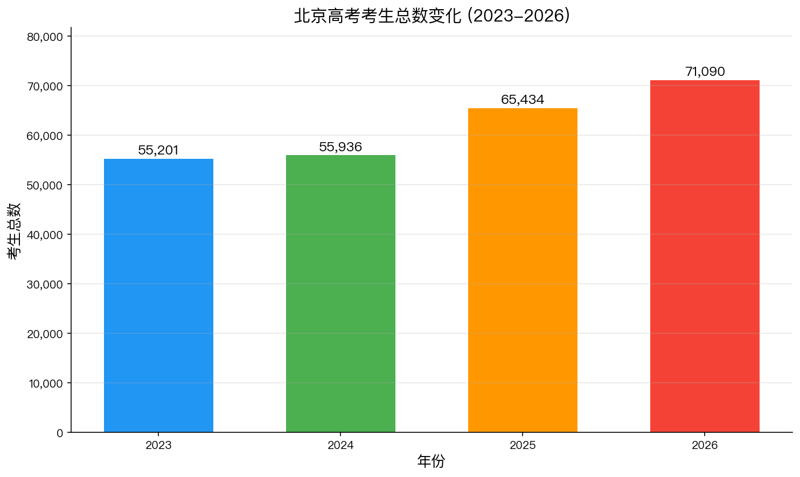
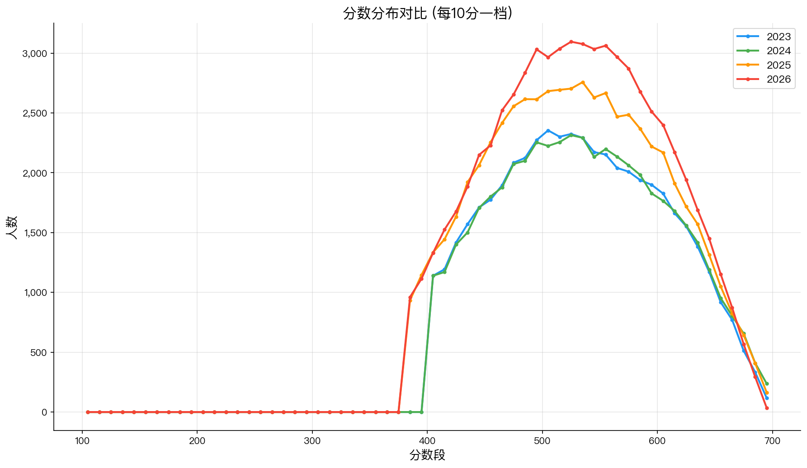
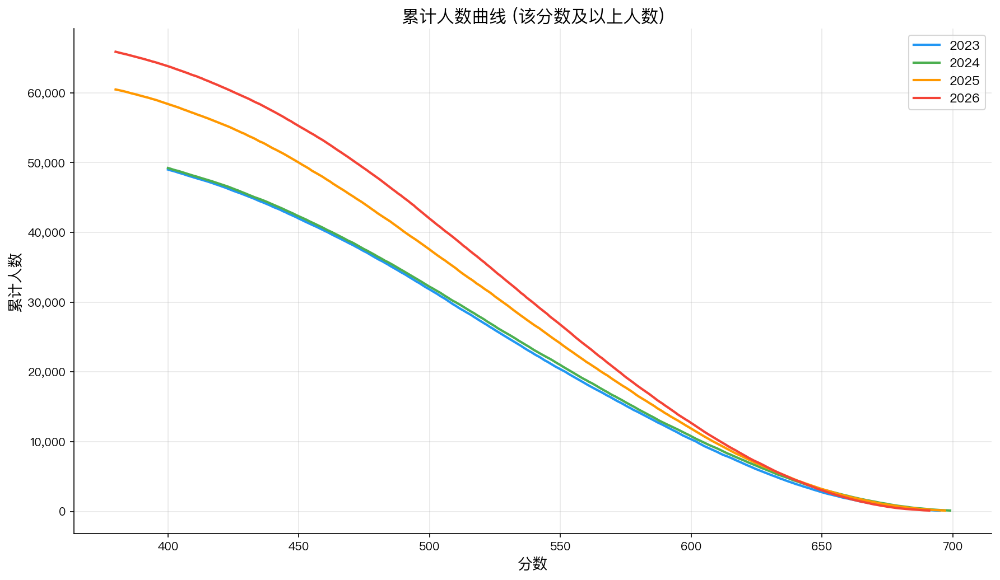
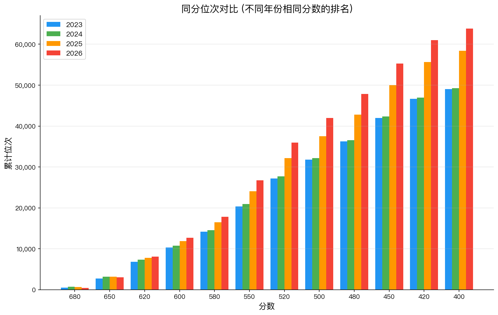
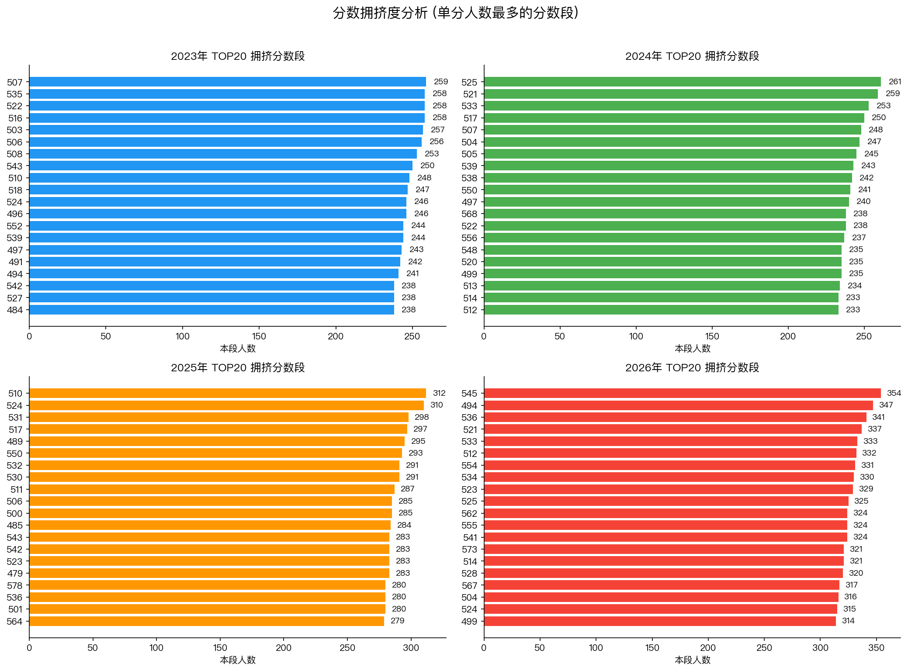
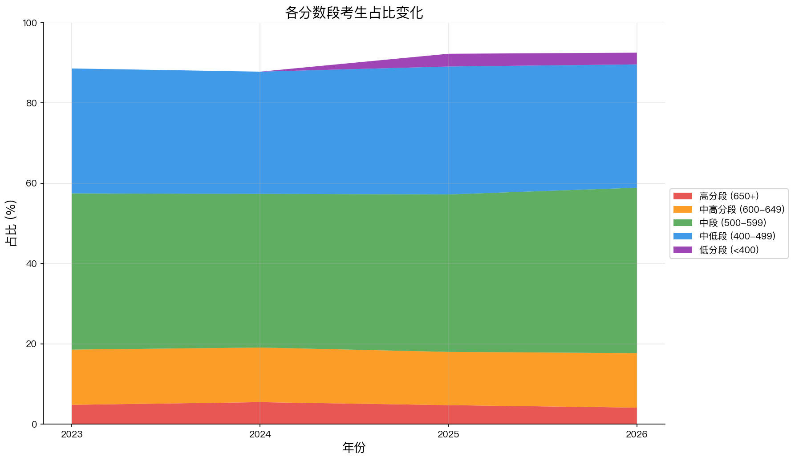

# 北京高考一分一段表 (2023-2026)

北京市高考考生分数分布数据，来源于[北京教育考试院](https://www.bjeea.cn)。

## 数据来源

| 年份 | 数据来源 | 链接 |
|------|----------|------|
| 2023 | 北京教育考试院 | https://www.bjeea.cn/html/gkgz/fujian/2023/0625/83922.html |
| 2024 | 北京教育考试院 | https://www.bjeea.cn/html/gkgz/fujian/2024/0625/85432.html |
| 2025 | 北京教育考试院 | https://www.bjeea.cn/uploads/soft/250625/172-2506250Q456.pdf |
| 2026 | 北京教育考试院 | https://www.bjeea.cn/uploads/soft/260625/2026年北京市高考考生分数分布.pdf |

## 数据说明

- **score**: 分数段
  - `698分以上` 表示该分数及以上的考生
  - `690→699` 表示 690-699 分数段（仅低分段使用区间表示）
- **count**: 本段人数（该分数/分数段内的考生人数）
- **cumulative**: 累计人数（该分数及以上/以下的累计考生人数）

> 注：统计中的分数含全国性照顾加分。

## 数据文件

### 按年份

- `data/beijing_gaokao_score_segments_2023.csv` / `.json`
- `data/beijing_gaokao_score_segments_2024.csv` / `.json`
- `data/beijing_gaokao_score_segments_2025.csv` / `.json`
- `data/beijing_gaokao_score_segments_2026.csv` / `.json`

### 合并数据

- `data/combined.csv` — 四年数据合并的 CSV
- `data/combined.json` — 四年数据合并的 JSON

## 数据规模

| 年份 | 记录数 | 最高分 | 最低分段 |
|------|--------|--------|----------|
| 2023 | 327 | 696分以上 | 100→109 |
| 2024 | 331 | 700以上 | 100→109 |
| 2025 | 347 | 698分以上 | 100→109 |
| 2026 | 341 | 692分以上 | 100→109 |

## 数据分析

### 考生总数变化

四年考生总数从 2023 年的 55,201 人增长至 2026 年的 71,090 人，增幅约 29%。



### 分数分布

各年度分数分布曲线叠加对比，可观察分布形态变化和峰值偏移。



### 累计人数曲线

同一分数在不同年份对应的累计位次差异，反映竞争强度变化。



### 同分位次对比

相同分数在不同年份的排名对比，位次后移意味着竞争加剧。



### 分数拥挤度

单分人数最多的分数段，拥挤度越高志愿填报区分度越低。



### 分段占比变化

各分数段考生占比的堆叠面积图，反映考生结构变化。



## 使用示例

### Python

```python
import json

with open('data/combined.json', 'r', encoding='utf-8') as f:
    data = json.load(f)

# 查询2025年690分对应的位次
for row in data['years']['2025']['data']:
    if row['score'] == '690':
        print(f"本段人数: {row['count']}, 累计人数: {row['cumulative']}")
        break
```

### 命令行

```bash
# 查看2025年650分以上的累计人数
csvsql --query "SELECT cumulative FROM beijing_gaokao_score_segments_2025 WHERE score = '650'" data/beijing_gaokao_score_segments_2025.csv
```

## License

本仓库中的数据来源于官方公开的招生信息，以 [CC0 1.0](https://creativecommons.org/publicdomain/zero/1.0/) 协议发布。
